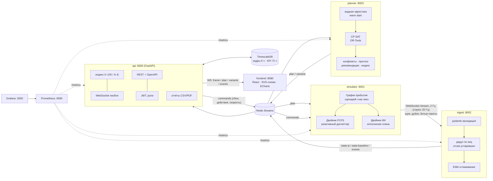

# Архитектура «Цифровой станции»

## Сервисы

| Сервис | Ответственность | Масштабирование |
|---|---|---|
| **simulator** | Генерирует поток поездов по сценарию и гоняет два двойника на одних и тех же данных: `baseline` (FCFS) и `ai` (исполняет план). Принимает сбои и действия из потока `commands`, план из `plan`. | Один экземпляр на станцию. |
| **ingest** | Приём телеметрии по WS с reconnect, exponential backoff и jitter. Валидация (битые пакеты уходят в `ingest:dlq`), дедупликация, отсев устаревших снимков, сглаживание координат. Публикует нормализованное состояние в шину. | Горизонтально: по consumer group на источник. |
| **planner** | Пересчёт плана по таймеру (2 с) и по сбою (debounce 200 мс). При сбое три варианта считаются параллельно, лучший применяется автоматически. Fallback на эвристику гарантирует ответ. | Stateless, состояние берётся из шины, можно держать реплики. |
| **api** | REST (история, конфигурация, сбои, отчёты) и WS fan-out для дашборда. Индекс считает api, поэтому веса применяются мгновенно. Пишет историю в TimescaleDB, при недоступной БД держит кольцевой буфер в памяти. | Stateless, за балансировщиком. |
| **frontend** | Диспетчерский дашборд: SVG-схема, Гант, очередь, рекомендации, варианты, история, сравнение, настройки. | Статика в nginx. |

## Шина событий (Redis Streams)

| Поток | Производитель → потребители | Содержимое |
|---|---|---|
| `state:ai`, `state:baseline` | ingest → planner, api | нормализованный снимок станции |
| `events` | ingest → api, planner | прибытие, приём, отправление, сбой, действие |
| `commands` | api → simulator | сбои, действия диспетчера, скорость, стресс |
| `plan` | planner → simulator, api | применённый план |
| `variants` | planner → api | 3 варианта при сбое |
| `planner:control` | api → planner | применить вариант вручную |
| `ingest:dlq` | ingest | отбракованные сообщения |

## Модель планирования (CP-SAT)

Переменные для каждого поезда в горизонте 150 мин: момент приёма `entry_i` (это и есть слот), выбор пути `x_ij`, момент отправления `dep_i`.

Ограничения:
- **пути**: `NoOverlap` по каждому пути. Поезд занимает путь на интервале `[entry_i, dep_i + t_горл + t_тех)`. Совместимость по длине, типу и электрификации задана через выбор `x_ij`. Закрытые пути и резерв исключены.
- **горловины**: `NoOverlap` по каждой стрелочной улице. Маршрут приёма `[entry_i, entry_i + 3 мин)` и маршрут отправления `[dep_i, dep_i + 3 мин)`, так что маршруты с общими стрелками не пересекаются.
- **технология**: `dep_i ≥ entry_i + t_горл + t_обсл`. Пассажирский не уходит раньше графика.
- **локомотивы и бригады**: `Cumulative` с ёмкостью, равной пулу. Ресурс, который ещё не освободился, занимает фиксированный интервал, ресурс прибывающего поезда освобождается после его приёма и экипировки. Поезд забирает ресурс с момента подачи `dep_i − t_подачи`. Конкретные номера назначаются после решения сопоставлением по времени.
- **цель**: `Σ prio_i·(entry_i − eta_i) + Σ prio_i·1.5·max(0, dep_i − dep_граф_i) + штраф за «голодание» (ожидание > 30 мин) + штраф за смену пути относительно прошлого плана + штраф за нехватку ресурса`.

Warm start идёт от жадной эвристики. Лимит 1,5 с на плановый пересчёт и 1 с на каждый из трёх параллельных вариантов.

## Индекс эффективности

`I = 100 · Σ wₖ·sₖ / Σ wₖ`, где `sₖ ∈ [0, 1]`. Потеря фактора `lossₖ = 100·wₖ·(1−sₖ)/Σw`, сумма потерь равна `100 − I`. Top-5 факторов с наибольшей потерей выводятся с текстовой причиной.

| Фактор | Вес | Оценка sₖ |
|---|---|---|
| Пропускная способность | 0.25 | отправлено за час / должно уйти по графику |
| Отклонение от графика | 0.20 | 1 − отклонение / 40 мин |
| Загрузка путей | 0.15 | «колокол»: 1 при 55–85%, штраф и за простой путей, и за переполнение |
| Конфликты маршрутов | 0.15 | 1 − конфликты / 8 |
| Простой ресурсов | 0.10 | 1 − ожидание локомотива/бригады / 30 мин |
| Очередь на подходе | 0.15 | 1 − ожидание приёма / 45 мин |

Категории: **Норма** ≥ 75, **Внимание** 50–74, **Критично** < 50. Буквы: A ≥ 85, B ≥ 70, C ≥ 55, D ≥ 40, E. Веса и пороги лежат в `config/index.yaml`, admin меняет их через UI или `PUT /api/config/index`. Изменения сохраняются в БД и применяются без перезапуска.

## Надёжность канала
- ingest ↔ simulator: reconnect с backoff от 0,5 до 30 с плюс jitter. Статус связи пишется в `link:simulator` и в метрику `ingest_source_connected`.
- api ↔ UI: ping раз в 5 с. Клиент сам переподключается с backoff. После reconnect сервер присылает `hello`, план, варианты и полный кадр.
- Медленный клиент не тормозит остальных: у каждого клиента слот «последнего кадра», устаревшие кадры вытесняются (метрика `api_frames_dropped_total`).
- Без БД api продолжает работать: история хранится в кольцевом буфере в памяти.
